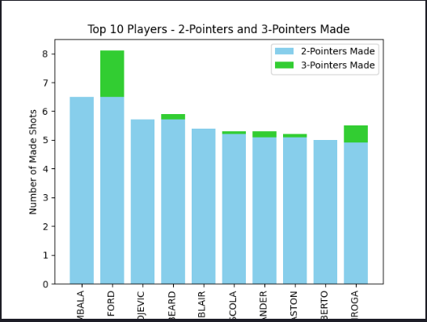
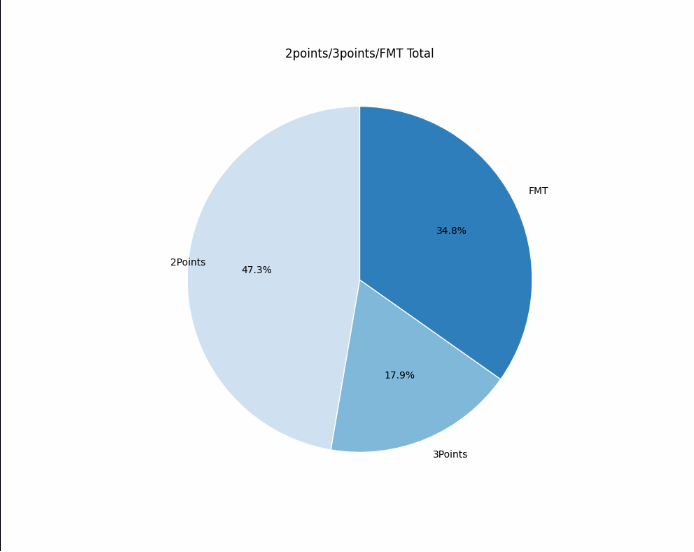
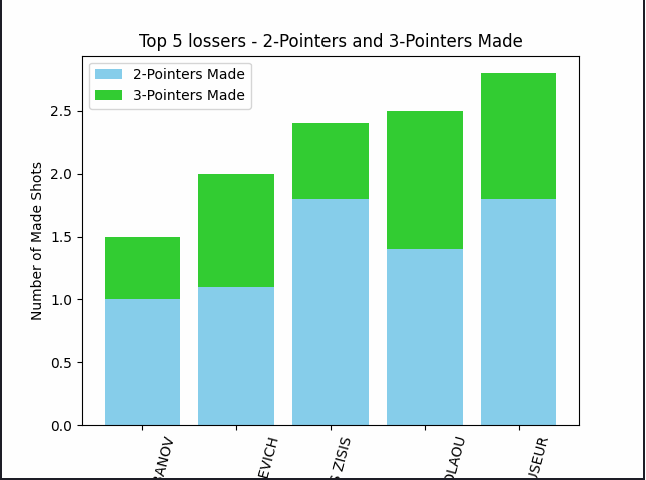
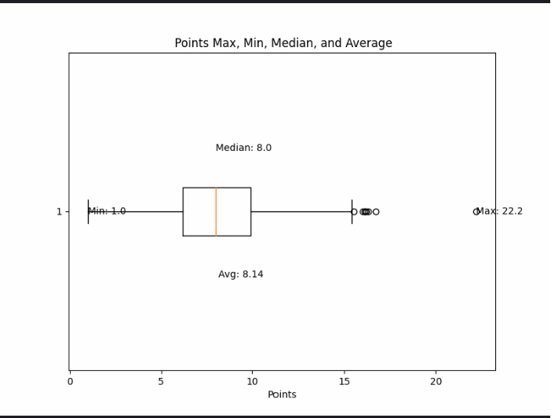

# Final_Project
# Eurolygos visų laikų visų žaidėjų analizė
### Projektas skirtas išanalizuoti pagrindinius Krepšinio rodiklius, palyginti žaidėjus ir suprasti tendencijas 
## Duomenų surinkimas 
### Duomenų surinkimui naudojamos bibliotekos, norint paleisti kodą reikia instaliuoti ir importuoti šias bibliotekas: 
        `from bs4 import BeautifulSoup
        from selenium import webdriver`
### Duomenys buvo gaunami iš oficialios Eurolygos svetainės: 
        https://www.euroleaguebasketball.net/euroleague/stats/expanded/?size=1000&viewType=traditional&seasonMode=All&statisticMode=perGame
### Analizei atlikti buvo naudojami duomenys 578 krepšyninkų ir daugiau nei 1000 sužaistų krepšynio varžybų. 
### Pagrindiniai analizės rodikliai sužaistų varžybų skaičius (GP), dvitaškių, tritaškių, baudų pataikymas,bendras pelnytų taškų per varžybas vidurkis.
## Duomenų apdorojimas
### Gauti duomenys prieš analizę buvo išvalyti ir pakoreguoti, kad su jais galima būtų atlikti analitinius veiksmus 
    `'Min': columns[5].text.strip().split(':')[0], ir
    df['PM_2'] = df['PM_2'].astype(float)`
    ir išsaugoti į CSV failą 
    `df.to_csv('BasketAll4.csv')`
## Duomenų analizė ir vizualizavimas
### Duomenų analizei ir vizualizavimui buvo naudojamos sekančios bibliotekos:
  ` import numpy as np
   import matplotlib.pyplot as plt`
### Analizę pradėjome nuo visų laikų TOP10 žaidėjų pagal sužaistas rungtines
### Analizavome Kaip TOP10 dvitaškių metikams sekasi mesti tritaškius. Išvada grafikas kalba pats už save, didžioji dalis TOP dvitaškininkų nemeta arba meta labai mažai tritaškių

### Naudojant MIN MAX MEDIANA ir MEAN funkcijas buvo atvazduota visų žaidėjų per rungtines pelnytų taškų vidurkio statistiniai rodikliai. Diagrama gali padėti vertinti perkamo krepšininki potencialą ir vertę komandoja.
### Toliaus analizavome TOP 10 žaidėjus pagal pelnytų taškų skaičių, tarp lyderių skirtuma labai mažas išsiskiria 1 žaidėjas.
### Analizuojant duomenys naudojant NumPY biblioteką paskaičiavome pelnytų dvitaškių tritaškių ir baudų pasisikirstymą per rungtynes. Išvada tritaškiai sudaro mažiau nei 18% visų pelnytų taškų.

### Ir pabaigai analizavome nesekmingiausius Eurolygos žaidėjus. TOP 5 žaidėjai kurie patenka įtop 30 žaidėjų sarašus pagal žaistų varžybų skaičių 
### tačiau jų rezultatyvumas mažiau nei 3 taškai  per varžybas ir tai beveik minimalus pelnytų taškų skaičius per varžybas.

 ## Duomenų bazėje naudojamų trumpinių sarašas:
 Player - Player name
Team -Team name
GP - Games played
GS - Games started
Min - Minutes played
PTS - Points scored
2PM - Two-pointers made
2PA - Two-pointers attempted
2P% - Two-point %
3PM- Three-pointers made
3PA -Three-pointers attempted
3P%-Three-point %
FTM - Free throws made
FTA - Free throws attempted
FT% - Free-throw %
OR - Offensive rebounds
DR -Defensive rebounds
TR -Total rebounds
AST - Assists
STL -Steals
TO -Turnovers
BLK -Blocks
BLKA -Blocks against
FC - Personal fouls committed
FD - Personal fouls drawn
PIR - Performance Index Rating